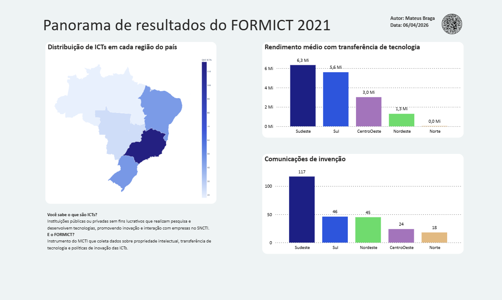
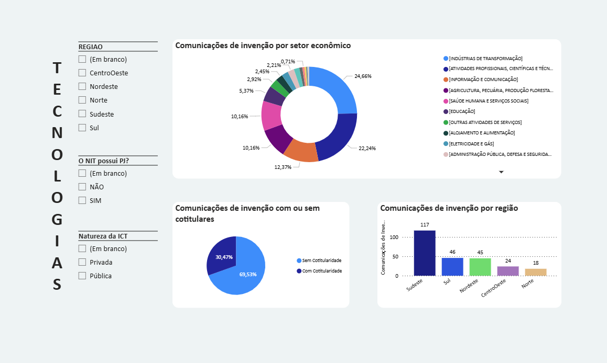
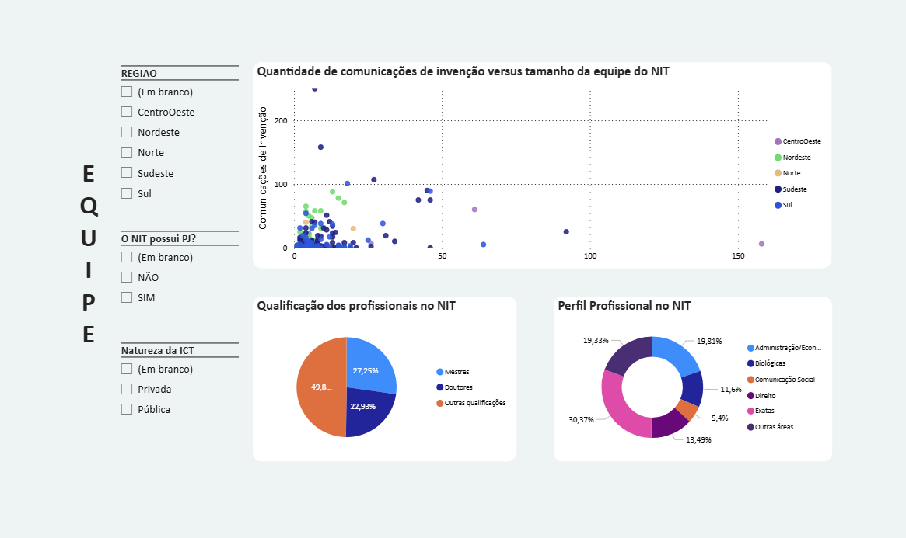
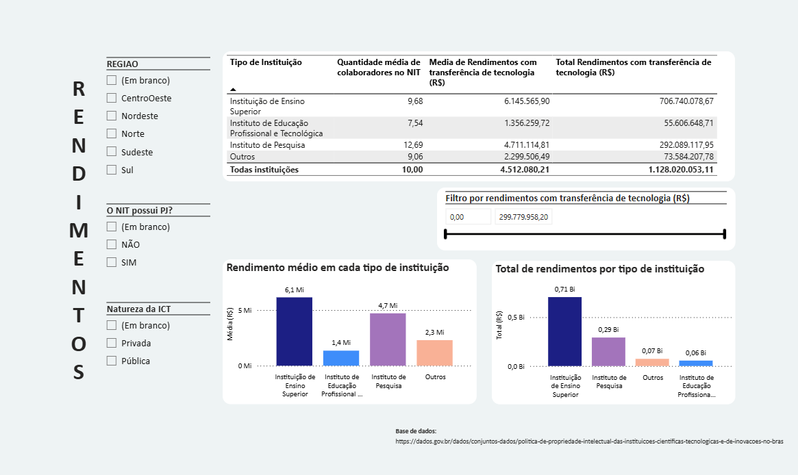

# Análise do FORMICT: panorama da prestação de contas das Instituições de Ciência e Tecnologia no Brasil em 2021
Este relatório realizado no PowerBI traz um panorama da prestação de contas das Instituições de Ciência e Tecnologia no Brasil no ano de 2021, conforme dados públicos fornecidos pelo MCTI.

## Dashboard

O mapa coroplético do Brasil mostra que a maior parte das ICTs estão concentradas na região sudeste, enquanto os gráficos de barras mostram o rendimento médio com a transferência de tecnologia e a quantidade de comunicações de invenção em cada região.

Ao analisarmos as comunicações de invenção, podemos perceber o setor econômico preponderante é a indústria de transformação. A maior parte das invenções são sem cotitularidade e o lider de depósitos é o sudeste. 

Com relação às equipes que compõem os Núcleos de Inovação Tecnológica, podemos observar pelo gráfico de dispersão que não há uma correlação direta entre a quantidade de colaboradores e a quantidade de comunicações de invenção. Notamos que a equipe é composta majoritariamente de mestres ou doutores, e a principal área de formação é em Ciências Exatas.

Já em relação ao rendimento com transferência de tecnologia, a região que alcança maior rendimento médio é a sudeste, sendo que as Instituições de Ensino Superior lideram este ranking.

## Relatório completo

## Base de dados: 
https://dados.gov.br/dados/conjuntos-dados/politica-de-propriedade-intelectual-das-instituicoes-cientificas-tecnologicas-e-de-inovacoes-no-bras
